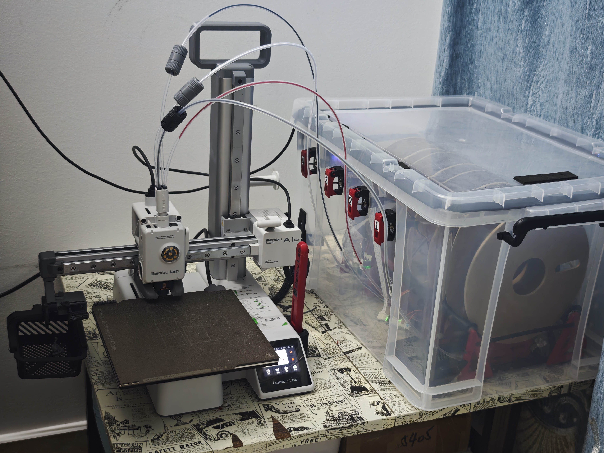
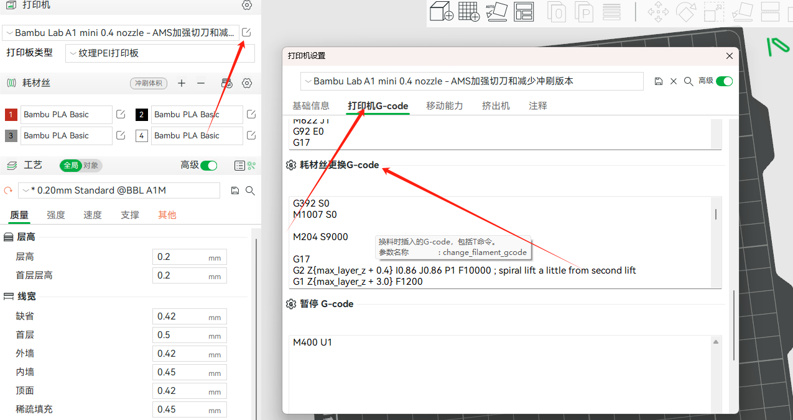
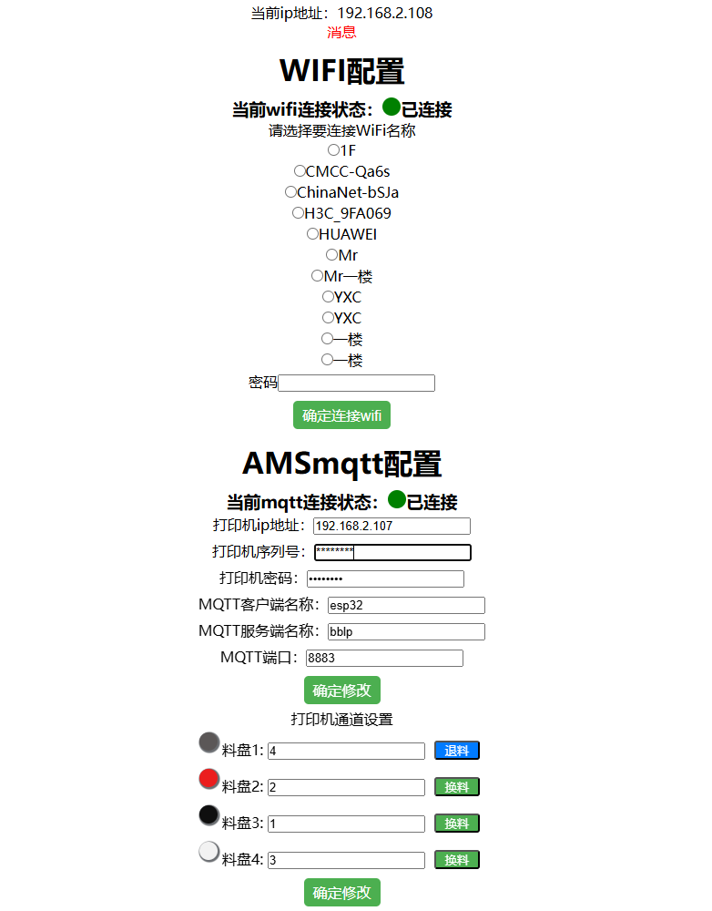
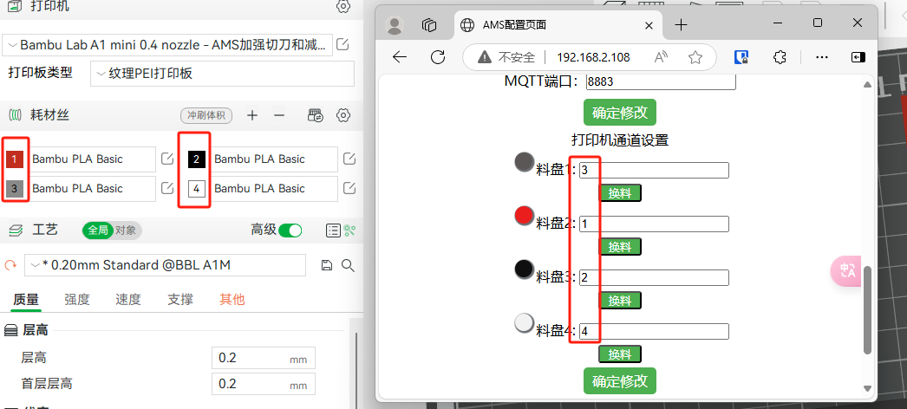

# YAO_AMS

**基于 YBA-AMS 改进的拓竹打印机自动换料系统（ESP32-C3 + MicroPython）**



---

## 目录

- [简介](#简介)
- [功能特性](#功能特性)
- [硬件方案](#硬件方案)
  - [1 个电机 + 4 路电磁离合](#1-个电机--4-路电磁离合)
  - [ESP32-C3 引脚约束](#esp32-c3-引脚约束)
  - [默认接线表](#默认接线表)
  - [电气注意事项](#电气注意事项)
  - [物料清单](#物料清单)
- [项目结构](#项目结构)
- [快速开始](#快速开始)
- [换料时序与软件架构](#换料时序与软件架构)
- [硬件配置项](#硬件配置项)
- [调试](#调试)
- [GitHub Actions 自动编译](#github-actions-自动编译)
- [本地开发与自测](#本地开发与自测)
- [常见问题](#常见问题)
- [附录 A：部分 MQTT 命令说明](#附录-a部分-mqtt-命令说明)
- [附录 B：G-code 参考](#附录-bg-code-参考)
- [致谢与许可](#致谢与许可)

---

## 简介

本项目是适配拓竹（Bambu Lab）打印机的 AMS 自动换料系统，基于 YBA-AMS 改进而来。

- **主控**：ESP32-C3，使用 MicroPython 开发
- **通信**：MQTT over TLS 与打印机通信；TCP + Web 页面与操作者交互
- **执行机构**：**1 个共享直流电机 + 4 路电磁离合**（见下文）
- **已验证**：A1 mini，4 通道；主板预留扩展接口，最多支持 8 通道
- **固件要求**：打印机固件版本需低于 `01.03.01.00`
- **换料速度**：约 1 分半（从停止打印到恢复打印，含冲刷时间）

> ⚠️ **与上游版本的主要差异**：上游 YBA-AMS 是「每个料盘位一个电机」，本项目
> 改为「一个共享电机 + 每通道一个电磁离合」。这带来两个变化：
> 1. GPIO 从 8 个降到 6 个，且不再使用 ESP32-C3 上不存在的 GPIO22/23；
> 2. **引入了新的安全约束：任何时刻最多只能有 1 路电磁离合吸合**，
>    软件层用四重机制强制保证（见 [换料时序与软件架构](#换料时序与软件架构)）。

---

## 功能特性

| 能力 | 说明 |
| --- | --- |
| 自动换料 | 监听打印机 MQTT 状态，检测到换料请求后自动退料 + 进料，再恢复打印 |
| 多通道 | 默认 4 通道，最多 8 通道 |
| 颜色映射 | 网页上把打印机的 T 通道号映射到任意物理料盘位，配置持久化 |
| 掉电保持 | WiFi / MQTT / 通道映射 / 当前料盘全部存在 `config.json`，断电重启不丢 |
| 状态指示 | 板载 LED：熄 = 未联网，闪 = WiFi 已连，常亮 = MQTT 已连 |
| 网页配置 | 连不上 WiFi 时自动开热点供初次配置；之后通过页面 IP 访问 |
| 硬件调试 | 网页上实时显示 4 路离合状态，并可手动点动任意通道 |
| 电磁离合互斥 | 软件层强制同一时刻最多 1 路吸合，含启动检查 / 吸合前复核 / 运行期体检 |
| 一键烧录 | 一个 `.bin` 覆盖整片 Flash（引导程序 + 分区表 + MicroPython + 全部代码 + umqtt 库），烧完直接上电即用 |
| CI 自动构建 | 每次提交自动编译：语法检查 + 自测 + 单文件固件 + `.mpy` 包；主分支更新 `latest` 预发布版，打 tag 发正式 Release |

---

## 硬件方案

### 1 个电机 + 4 路电磁离合

```
                        ┌── 电磁离合 1 ──> 料盘位 1 送料轮
                        ├── 电磁离合 2 ──> 料盘位 2 送料轮
   共享直流电机 ────────┤
   (H 桥 IN1 / IN2)     ├── 电磁离合 3 ──> 料盘位 3 送料轮
                        └── 电磁离合 4 ──> 料盘位 4 送料轮

   动作：需要哪个料盘位送料，就吸合那一路离合，让它的送料轮咬上电机主轴，
        然后电机正转（进料）或反转（退料），动作完成后立刻断开离合。
```

**为什么必须保证只有 1 路吸合？** 如果有 2 路同时吸合，电机会同时拖动两个
料盘位的送料轮，两卷料互相拉扯，结果是断料、打滑或打印机报错。除了机械损坏，
4 路线圈同时吸合的浪涌电流也容易把 5V 电源拉塌，导致主控复位。

软件层的保证机制（`python_code/motor_clutch.py`）：

1. **物理层前置断开** —— 任何一次吸合之前，都先无条件下发「全部断开」电平
2. **吸合前状态复核** —— 写完全部断开后回读每一路，发现残留就再次断开并取消本次动作
3. **直接调用拦截** —— `Clutch` 的引脚只能由总线改写，绕过总线调用会抛异常
4. **运行期体检** —— 主循环每个周期调用 `assert_single()`，发现多路吸合立即全部断开

这四条都有对应的自动化测试覆盖，见 [本地开发与自测](#本地开发与自测)。

### ESP32-C3 引脚约束

ESP32-C3 只有 `GPIO0 ~ GPIO21`，其中相当一部分不能当普通 IO 用：

| GPIO | 用途 | 能否使用 |
| --- | --- | --- |
| `GPIO2` / `GPIO8` / `GPIO9` | strapping 引脚，上电电平决定启动模式（GPIO9 = BOOT 键） | 谨慎，见下 |
| `GPIO4` ~ `GPIO7` | JTAG 调试口 | 可以用，代价是放弃 JTAG |
| `GPIO11` ~ `GPIO17` | 模组内置 SPI Flash（含 VDD_SPI） | **不可用** |
| `GPIO18` / `GPIO19` | USB D- / D+ | 接了 USB 座就不能用 |
| `GPIO20` / `GPIO21` | UART0 RX / TX，默认日志与 REPL 口 | 不建议用 |

因此真正「干净」的引脚只有 **GPIO0、GPIO1、GPIO3、GPIO10**（外加放弃 JTAG 的
GPIO4~GPIO7）。本项目的默认配置就只用了这几只脚。

> 📌 上游代码里的 **GPIO22 / GPIO23 是经典 ESP32（38 脚）的编号，ESP32-C3 上不存在**，
> 必须改掉。本项目已全部重排。

### 默认接线表

| 信号 | GPIO | 说明 |
| --- | --- | --- |
| 电机 H 桥 IN1 | `GPIO4` | 方向 `1` = 进料（正转） |
| 电机 H 桥 IN2 | `GPIO5` | 方向 `-1` = 退料（反转） |
| 电磁离合 1 | `GPIO6` | 料盘位 1 |
| 电磁离合 2 | `GPIO7` | 料盘位 2 |
| 电磁离合 3 | `GPIO10` | 料盘位 3 |
| 电磁离合 4 | `GPIO3` | 料盘位 4 |
| 状态 LED | `GPIO2` | 板载蓝灯（沿用原代码） |
| 到位开关 1~4 | *未安装* | 预留，见下方说明 |

改接线只需要改 `python_code/hardware_config.py` 里的一组常量，不用动业务代码。

**关于状态 LED 用 GPIO2**：GPIO2 是 strapping 引脚，上电瞬间需要为高电平。
ESP32-C3 模组的 strapping 脚内部有弱上拉，上电默认为高，所以「LED 接对地」
通常不影响启动。如果遇到偶发无法启动，把 LED 改到 `GPIO0` 或 `GPIO1`，
并修改 `hardware_config.py` 里的 `LED_PIN`。

**关于到位开关（限位/微动开关）**：当前**未安装**，程序自动进入降级模式。
它的作用是探测「当前正在用哪个料盘」和判断「料有没有真的推动」。装了开关后，
把引脚填进 `hardware_config.py` 的 `LIMIT_SWITCH_PINS` 即可自动启用探测逻辑。

推荐接法（开关一端接 GPIO、另一端接 GND，内部上拉，低电平触发）：

- 通道 1 / 2：`GPIO0`、`GPIO1`（最干净）
- 通道 3 / 4：可用 `GPIO2`、`GPIO8` 或 `GPIO9` —— 这三个是 strapping 脚，
  但「上拉 + 开关对地」的接法空闲时正好是高电平，符合 strapping 要求，是安全的

### 电气注意事项

> ⚠️ **这两条不做大概率会烧板子，请务必看完。**

1. **电磁离合线圈必须反向并联续流二极管**（1N4148 / 1N5819 均可）。
   线圈是感性负载，断开瞬间会产生几十伏的反电动势，会击穿 GPIO 或驱动管。
2. **不要用 GPIO 直接驱动离合线圈**。GPIO 输出只有 20mA 左右，离合线圈通常
   需要 100mA 以上。中间必须加三极管（S8050 / 2N2222）、MOS 管
   （AO3400 / IRLZ44N）或光耦隔离的驱动板；三极管方案基极要串 1kΩ 电阻。

另外：4 路离合的供电建议单独走一路 5V，不要和 ESP32-C3 共用同一根细线。

### 物料清单

| 部件 | 数量 | 备注 |
| --- | --- | --- |
| ESP32-C3 开发板 | 1 | 任意 C3 模组板均可 |
| 直流减速电机 | 1 | 带动共享主轴 |
| 电磁离合器 | 4 | 每个料盘位一个 |
| H 桥驱动模块 | 1 | 如 L9110 / DRV8833 / TB6612 |
| 续流二极管 | 4 | 1N4148 / 1N5819 |
| 三极管或 MOS 管 | 4 | 驱动离合线圈，或直接用 4 路继电器/光耦模块 |
| 到位微动开关（可选） | 0~4 | 现在没有也能跑，见降级模式说明 |
| 3D 打印件 | — | 见 [`打印件/`](./打印件) 目录 |

---

## 项目结构

```
yaoams/
├── python_code/                  # ★ 要上传到 ESP32-C3 的全部代码
│   ├── main.py                   # 上电自动启动入口（保持 .py，不能编译成 .mpy）
│   ├── boot.py                   # 启动前脚本（当前为空壳，保留）
│   ├── AMS_WEB.py                # Web 配置服务 + 任务调度入口（继承 AMS）
│   ├── AMS_MODEL.py              # ★ 换料业务逻辑：探测料盘 / 退料 / 进料 / MQTT 调度
│   ├── device_processing.py      # ★ 硬件驱动：料盘位对象(material)、电机/离合总线工厂
│   ├── motor_clutch.py           # ★ 共享电机 + 电磁离合驱动层（互斥约束在这里强制）
│   ├── hardware_config.py        # ★ 唯一的硬件配置入口：引脚、时序、降级参数
│   ├── network_model.py          # WiFi 连接管理（AP / STA）
│   ├── info_load.py              # 配置文件读写（wifi.dat / config.json）
│   ├── logout.py                 # 日志输出
│   ├── index.html                # Web 配置页面（含硬件调试面板）
│   ├── umqtt/                    # MQTT 客户端库（第三方，纳入仓库以保证烧录后自包含）
│   │   └── simple.py             #   来自 micropython-lib（MIT）
│   └── bambu/                    # 与拓竹打印机 MQTT 通信相关
│       ├── bambu_mqtt.py         # MQTT 客户端封装（连接、订阅、发布）
│       ├── bambu_commands.py     # 常用 MQTT 命令（resume / pushall ...）
│       ├── bambu_const.py        # 打印机状态码、HMS 错误码中英对照
│       ├── bambu_G_code.py       # 常用 G-code 片段（擦拭、切料、调温）
│       └── get_event_info.py     # 从推送报文里解析换料 / 状态 / 报错信息
├── tests/                        # ★ 桌面端自测（PC / CI 运行，不烧进板子）
│   ├── run_tests.py              # 测试入口：python tests/run_tests.py
│   └── mpy_stubs/                # machine / network / ujson / uasyncio / umqtt 桩模块
├── tools/
│   ├── make_firmware_bin.py      # ★ 合成「单文件可烧录固件」（官方固件 + 本项目代码）
│   ├── lfs_mkfs.c                # ★ 生成 / 校验文件系统镜像（littlefs 2.8，与固件内置同源）
│   └── build_mpy.py              # 交叉编译 .mpy 并打包部署 zip
├── .github/workflows/build.yml   # ★ GitHub Actions：检查 + 自测 + 固件 + .mpy + 发布
├── g_code/                       # Bambu Studio 换料 G-code（要粘贴到切片软件）
├── 打印件/                        # 结构件 STL / 3MF
├── assets/                       # 文档图片
├── dist/                         # 构建产物（已忽略，不进版本库）
├── .gitignore
├── LICENSE
└── README.md
```

---

## 快速开始

### 第 1 步：烧录（推荐：一个文件搞定）

到本仓库的 **Releases** 页面下载 `esp32c3-ams-firmware.bin`
（每次提交都会自动重新构建，标题为「最新构建」的那份永远是最新的），然后：

```bash
pip install esptool
esptool.py --chip esp32c3 --port COM5 write_flash -z 0x0 esp32c3-ams-firmware.bin
```

就这一条命令。该文件从地址 `0x0` 开始覆盖**整片 4MB Flash**：

| 地址 | 内容 |
| --- | --- |
| `0x000000` | ESP32-C3 引导程序 |
| `0x008000` | 分区表（nvs / phy_init / app / vfs） |
| `0x010000` | MicroPython v1.23.0（官方发布的固件，未做修改） |
| `0x200000` | 文件系统（littlefs），放着 `python_code/` 的全部代码 + `umqtt` 库 |

也就是说：**不用先烧固件、也不用再上传任何 .py**，烧完直接上电就能跑，
下面第 2 步可以跳过，直接看第 3 步。

> 正常情况下不需要先 `erase_flash` —— 这个文件覆盖整片 Flash，旧文件系统区域会被
> 整体重写。只有在出现异常（之前烧过别的固件、或想彻底清空）时才先补一条
> `esptool.py --chip esp32c3 --port COM5 erase_flash`，然后再烧。

### 第 2 步（备选）：自己烧固件 + 上传代码

需要频繁改代码调试、或者不想整片重烧时，用这种方式。

先烧官方 MicroPython 固件：

```bash
esptool.py --chip esp32c3 --port COM5 erase_flash
esptool.py --chip esp32c3 --port COM5 write_flash -z 0x0 ESP32_GENERIC_C3-xxxx.bin
```

固件到 [micropython.org/download/ESP32_GENERIC_C3](https://micropython.org/download/ESP32_GENERIC_C3/)
下载。记住版本号（例如 `v1.23.0`），CI 与 `.mpy` 都要和它对齐。

然后用 `mpremote` 上传代码：

```bash
pip install mpremote

# Windows
mpremote connect COM5 fs cp -r ./python_code/ :
# Linux / macOS
mpremote connect /dev/ttyACM0 fs cp -r ./python_code/ :
```

也可以直接用 Thonny 把 `python_code/` 里的文件拖到设备根目录（注意 `bambu/`
和 `umqtt/` 要建成同名子目录）。

或者用 CI 编译好的 `.mpy` 包（体积更小、启动更快）：

```bash
# 1) 从 GitHub Actions 下载 esp32c3-ams-mpy-v1.23.0 构件，或本地编译
pip install mpy-cross==1.23.0
python tools/build_mpy.py

# 2) 解压后整体上传
mpremote connect COM5 fs cp -r ./dist/ :
```

> ⚠️ `mpy-cross` 的版本必须和板子上的固件版本一致，否则设备会报
> `ValueError: incompatible .mpy file`。
>
> 注意 `boot.py` / `main.py` 必须是源码 `.py`（MicroPython 是直接执行这两个文件，
> 它们被编译成 `.mpy` 后不会被执行）。

### 第 3 步：修改 Bambu Studio 的换料 G-code

Bambu Studio → 打印机设置 → 机器 G-code → **Change filament G-code**，
把内容替换成 [`g_code/`](./g_code) 目录里的版本（二选一）：

- `切换耗材g_code.txt` —— 基础版
- `切换耗材（减少冲刷次数和加强切刀版本）.txt` —— 冲刷更少、切料更彻底（推荐）

关键点是里面必须有这一行，AMS 靠它知道「该换料了」：

```gcode
M73 P101 R[next_extruder]
M400 U1
```



### 第 4 步：首次配置

1. 给主板上电。如果还没配过 WiFi，它会自动开启热点
   **`AMS_WIFI`**，密码 **`A12345678`**
2. 电脑连上该热点，浏览器打开 `192.168.4.1`
3. **WiFi 配置**：选择你的 WiFi 并填密码 → 确定连接
   （必须在和打印机同一个网络下）
4. 连上后页面会显示主板分配到的新 IP，**记下它**，之后都用这个 IP 访问
5. **AMS MQTT 配置**：填入打印机的 IP、序列号、访问码（8 位）、MQTT 端口等 → 确定修改
6. **打印机通道设置**：把「料盘 1~4」映射到打印机要用的通道号，并点色块设置颜色



### 第 5 步：开始打印

1. 确认板载 LED **常亮**（= MQTT 已连接）。闪烁表示只连上了 WiFi。
2. 在切片软件里把耗材映射到对应通道：

   

3. 开始打印。打印机暂停并请求换料时，AMS 会自动完成换料并恢复打印。

---

## 换料时序与软件架构

### 分层结构

```
        ┌─────────────────────────────────────────────┐
        │  AMS_WEB.py     Web 配置 + asyncio 任务调度   │
        ├─────────────────────────────────────────────┤
        │  AMS_MODEL.py   换料业务逻辑（时序编排）      │
        │    now_filament / fileament_move             │
        │    exchange_fileament                        │
        ├─────────────────────────────────────────────┤
        │  device_processing.py                        │
        │    material（料盘位门面）                     │
        ├─────────────────────────────────────────────┤
        │  motor_clutch.py                             │
        │    FilamentMotorBus ★ 离合互斥仲裁            │
        │    HBridgeMotor / Clutch / LimitSwitch       │
        ├─────────────────────────────────────────────┤
        │  hardware_config.py   引脚与时序配置          │
        └─────────────────────────────────────────────┘
```

### 一次换料的完整时序

```
打印机                           ESP32-C3 (AMS)
  │                                   │
  │ 暂停 + 换料 G-code                  │
  │ M73 P101 R[next_extruder]         │
  │ M400 U1                           │
  ├────────── MQTT 推送 ─────────────>│  get_is_change_ams() 识别到换料请求
  │                                   │
  │<───────── 发 M83（相对挤出）────────┤
  │                                   │
  │<───────── 发 G1 E-50 F200 ─────────┤  打印机把喷嘴里的料退出来
  │                                   │
  │                                   │  ① 吸合【旧】通道离合
  │                                   │     电机反转 → 把料收进缓冲区
  │                                   │     停电机 → 断开全部离合
  │                                   │
  │                                   │  ② 吸合【新】通道离合
  │                                   │     电机正转 → 把新料推向挤出机
  │                                   │     停电机 → 断开全部离合
  │                                   │
  │<───────── 发 G1 E50 F200 ─────────┤  打印机把料拉进喷嘴
  │                                   │     同时 AMS 辅助推料 1s
  │                                   │
  │                                   │  ③ 更新 filament_current 并写入 config.json
  │                                   │
  │<───────── 发 resume ──────────────┤
  │ 继续打印                           │
```

### 关键实现细节

**离合互斥**：所有「吸合 → 动作 → 断开」的复合操作都走 `bus.run()` 或
`bus.hold()`，两者都用 `try/finally` 保证即使中途抛异常也一定停电机、
断开全部离合。主循环里每 200ms 还会做一次 `assert_single()` 体检。

**降级模式（未安装到位开关时）**：这是当前的实际运行模式，有两点要注意：

- 无法探测「当前在用哪个料盘」，程序直接沿用 `config.json` 里记录的
  `filament_current`。**所以这种情况下不要手动插拔料盘**，否则记录会和实际不一致。
- 送料/退料改为按时间推进，时长由 `NO_LIMIT_LOAD_MS` /
  `NO_LIMIT_RETRACT_MS` 决定。这两个值**必须按实机实测调整**：
  太小 → 料没送到挤出机，打印机会报「耗材缺失」；
  太大 → 料被顶弯、在缓冲区堆积，甚至顶坏挤出机。

**H 桥换向死区**：电机换向时先两脚拉低、等待 `MOTOR_DEAD_TIME_MS`，
再切换到新方向，避免 H 桥上下管直通烧驱动芯片。

---

## 硬件配置项

所有硬件相关的参数都集中在 **`python_code/hardware_config.py`**，改完不用动业务代码。

| 配置项 | 默认值 | 说明 |
| --- | --- | --- |
| `MOTOR_PIN_IN1` / `MOTOR_PIN_IN2` | `4` / `5` | H 桥两个输入脚 |
| `MOTOR_DEAD_TIME_MS` | `30` | 换向死区时间，单位 ms |
| `CLUTCH_PINS` | `(6, 7, 10, 3)` | 4 路电磁离合对应的 GPIO |
| `CLUTCH_ACTIVE_LEVEL` | `1` | `1` = 高电平吸合；驱动板是低电平吸合时改成 `0` |
| `CLUTCH_ENGAGE_MS` | `80` | 吸合后等待机械咬合的时间 |
| `CLUTCH_RELEASE_MS` | `60` | 断开后等待彻底脱开的时间 |
| `CLUTCH_SETTLE_MS` | `20` | 通道切换时的额外静默时间 |
| `LIMIT_SWITCH_PINS` | `(None, None, None, None)` | 到位开关，`None` = 未安装；填了 GPIO 就自动启用探测 |
| `FILAMENT_STEP_MS` | `500` | 单步推送时长 |
| `RETRACT_STEPS` / `LOAD_RETRY_TIMES` | `15` / `10` | 退料步数 / 进料重试次数（有开关时提前结束） |
| `NO_LIMIT_RETRACT_MS` | `6000` | ★ 降级模式退料时长，**需实测调整** |
| `NO_LIMIT_LOAD_MS` | `8000` | ★ 降级模式进料时长，**需实测调整** |
| `LED_PIN` | `2` | 状态指示灯 |
| `CONFIG_FILE` | `"config.json"` | 持久化配置文件 |

`hardware_config.validate()` 会在启动时校验引脚是否合法（重复占用、
越界、踩到 Flash/USB/UART 保留脚），有问题直接报出来。把
`device_processing.py` 当脚本跑一次就能打印完整接线表并逐个点动 4 个通道：

```bash
# 在设备 REPL 里（或 mpremote）执行
import device_processing
```

---

## 调试

### 网页硬件面板

浏览器打开主板 IP，页面下半部分的「硬件调试」区块会显示：

- 电机当前方向（`1` 进料 / `-1` 退料 / `0` 停止）
- 4 路离合各自的吸合状态
- 累计冲突次数（**正常应始终为 0**；不为 0 说明离合驱动电路有问题）
- 每个通道的「进料 1s / 退料 1s」手动点动按钮

点动接口同样受互斥约束保护，不会出现两路同时吸合。

### 串口日志

`logout()` 会打印换料全过程，关键日志形如：

```
当前料盘:1新的料盘:3
开始退料
开始进料
换料第 1 次尝试
换料成功
```

出现 `离合体检异常` / `离合状态异常，已全部断开` 时，说明检测到了多路吸合，
请立刻断电检查离合的驱动电路是否有短路。

---

## GitHub Actions 自动编译与发布

`.github/workflows/build.yml` 分四个环节，**每次提交都会自动跑**（push 到任意分支、
提 PR、或在网页上手动点运行）：

| Job | 做什么 |
| --- | --- |
| **语法检查与逻辑自测** | `compileall` 检查全部 Python 文件；运行 `tests/run_tests.py` 验证离合互斥等硬件约束 |
| **交叉编译 .mpy 部署包** | 用 `mpy-cross` 把 `python_code/` 编译成 `.mpy`，打成一个 zip |
| **构建单文件固件 BIN** | 官方固件 + littlefs 文件系统镜像 → 合成可整片烧录的 BIN，并做四道校验 |
| **发布固件** | 主分支提交 → 更新滚动预发布版 `latest`；打 `v*` tag → 发正式 Release |

所有产物同时挂在 Actions 的 Artifacts 下（保留 30 天）和 Releases 页面。

**发布规则**

| 触发方式 | 结果 |
| --- | --- |
| push 到 `main` | 自动覆盖 Releases 里的 `latest`（预发布），下载地址固定不变 |
| push tag `v1.0.0` | 创建正式 Release `v1.0.0` |
| Pull Request | 只编译校验，不发布 |

```bash
git tag v1.0.0
git push origin v1.0.0
```

**单文件固件是怎么做出来的**

`tools/make_firmware_bin.py` 负责整个流程，核心是「文件系统必须与设备端同源」：

1. 从官方固件里**解析分区表**（不写死偏移），找到 `vfs` 分区（本板 `0x200000` 起，2MB）；
2. 用 `tools/lfs_mkfs.c` 生成 littlefs 镜像 —— 它链接的是**上游 littlefs 2.8**，
   与 MicroPython v1.23 内置的 `lib/littlefs` 完全一致，参数也照抄设备端
   `VfsLfs2.mkfs`（`block_size=4096`、`block_cycles=100`、`name_max=255` …）；
3. 与官方固件拼成从 `0x0` 覆盖整片 Flash 的 BIN；
4. 四道校验：用同一份 littlefs 代码回读并逐字节比对 → 产物重新解析镜像头与分区表 →
   校验块 0/1 偏移 8 处的 `littlefs` 魔数 → 再用另一套独立实现（littlefs-python）
   把 BIN 里的文件系统读一遍。

> ⚠️ 这些校验不是摆设。ESP32 端 `_boot.py` 挂载失败会走
> `inisetup.check_bootsec()`，只要首扇区不是 `0xFF` 就判定「文件系统损坏」并进入
> **死循环**，所以必须一次做对。脚本还会联网核对 littlefs 版本号，不一致直接报错停止。

**升级 MicroPython 版本**：改 `.github/workflows/build.yml` 顶部那 5 个变量即可，
文件里对每一项都有说明，其中 `MICROPYTHON_VERSION` 与 `LITTLEFS_VERSION` 的配套关系
由脚本自动检查。

**本地等价操作**：

```bash
python tests/run_tests.py                 # 自测
python tools/build_mpy.py                 # 交叉编译 .mpy 包

# 单文件固件（需要先编译那个小工具，CI 里是自动完成的）
gcc -O2 -o tools/build/lfs_mkfs tools/lfs_mkfs.c \
    <littlefs源码>/lfs.c <littlefs源码>/lfs_util.c -I<littlefs源码>
python tools/make_firmware_bin.py \
  --firmware-url "https://micropython.org/resources/firmware/ESP32_GENERIC_C3-20240602-v1.23.0.bin" \
  --out dist/esp32c3-ams-firmware.bin
```

> 本地生成固件需要 gcc；不想装就直接用 CI 产物（每次提交都会自动构建）。

---

## 本地开发与自测

核心的硬件安全逻辑可以在 PC 上直接验证，**不需要板子**。`tests/mpy_stubs/`
提供了一套 MicroPython 模块桩（`machine`、`network`、`ujson`、`uasyncio`、
`umqtt`），它会记录所有 GPIO 的写入，从而断言硬件约束。

```bash
python tests/run_tests.py
```

共 18 项测试，其中与电磁离合相关的关键几项：

| 测试 | 验证内容 |
| --- | --- |
| `test_only_one_clutch_engaged_at_a_time` | ★ 依次吸合 4 路离合，任何时刻吸合数都**不能超过 1** |
| `test_switch_channel_always_passes_through_all_off` | 切换通道时必须先经过「全部断开」，不允许出现两路咬合的瞬间 |
| `test_assert_single_detects_external_fault` | 模拟驱动电路故障导致两路吸合，体检必须发现并立即全部断开 |
| `test_hold_releases_on_exception` | 动作中途抛异常，也必须释放离合、停电机 |
| `test_motor_direction_and_dead_time` | 换向必须经过「两脚都拉低」的死区，H 桥不允许上下管同时导通 |
| `test_hardware_config_valid` | 引脚配置必须避开 ESP32-C3 的 Flash / USB / UART 保留脚 |

改动硬件层代码后请先跑一遍再上传。

---

## 常见问题

<details>
<summary><b>板子上电后没有反应 / 找不到 AMS_WIFI 热点</b></summary>

1. 确认 `main.py` 已经上传到设备**根目录**（不是子目录）。
   （用单文件固件整片烧录时，文件已经在文件系统里，这条基本不会踩到。）
2. 用串口工具（Thonny / `mpremote`）连上后看有没有报错，特别是
   `.mpy` 版本不匹配的 `ValueError: incompatible .mpy file`。
3. 确认 `boot.py` 和 `main.py` 是 `.py` 而不是 `.mpy` —— 这两个文件
   MicroPython 是直接 `exec` 文件内容的，不能编译成字节码。
</details>

<details>
<summary><b>串口反复打印 The filesystem appears to be corrupted / 一直重启</b></summary>

这是 MicroPython 挂载文件系统失败后的保护逻辑（`inisetup.check_bootsec()`）：
只要分区首扇区不是 `0xFF`，它就认定文件系统损坏，并进入死循环，不执行任何用户代码。

**正常烧录本仓库的单文件固件不会出现这个问题** —— 构建流程里有四道校验专门防它
（见 [GitHub Actions 自动编译与发布](#github-actions-自动编译与发布)）。一旦遇到，这样救回来：

```bash
# 1) 彻底擦除整片 Flash（关键，必须做）
esptool.py --chip esp32c3 --port COM5 erase_flash
# 2) 重新烧录
esptool.py --chip esp32c3 --port COM5 write_flash -z 0x0 esp32c3-ams-firmware.bin
```

反复出现的话，通常是固件版本与文件系统格式不配套（例如固件换了版本、但文件系统镜像
还是按旧版 littlefs 生成的），或者自己改过分区表。用本仓库 CI 产出的固件可避免。
</details>

<details>
<summary><b>LED 闪烁但不常亮，换料不动作</b></summary>

闪烁表示只连上了 WiFi，MQTT 没连上。检查：
- 打印机 IP / 序列号 / 访问码是否填对（访问码是 8 位，不是局域网密码）
- 主板和打印机是否在同一个网段
- 打印机固件版本是否低于 `01.03.01.00`
</details>

<details>
<summary><b>打印机报「耗材缺失」或料没送到位</b></summary>

当前没有到位开关，送料靠时间控制。把 `hardware_config.py` 里的
`NO_LIMIT_LOAD_MS` 调大一些（比如从 8000 调到 10000），逐步试到刚好够。
反过来，如果发现料被顶弯或在缓冲区堆积，就调小。
</details>

<details>
<summary><b>换料时出现断料 / 打印机报 AMS 异常</b></summary>

1. **首先检查是不是两路离合同时吸合了**。打开网页硬件面板看「冲突次数」，
   不为 0 就说明检测到过违规状态，通常是离合驱动电路短路或续流二极管没接。
2. 确认续流二极管已经反并联在每一路线圈两端。
3. 确认 4 路离合不是共用一根细电源线 —— 浪涌电流会拉塌电压。
</details>

<details>
<summary><b>网页打不开 / 找不到主板 IP</b></summary>

1. 首次使用：连热点 `AMS_WIFI`（密码 `A12345678`），访问 `192.168.4.1`。
2. 已配好的：在路由器后台找设备 IP，或看串口日志里打印的地址。
3. 换过 WiFi 或改了密码：板子连不上历史 WiFi 时会自动重新开热点。
</details>

<details>
<summary><b>想从 4 通道扩展到 8 通道</b></summary>

1. 在 `hardware_config.py` 里把 `CLUTCH_PINS` 扩成 8 个 GPIO，
   `LIMIT_SWITCH_PINS` 同步补齐长度。
2. `motor_clutch.FilamentMotorBus` 本身支持任意路数，不用改。
3. 注意 ESP32-C3 的干净引脚有限，8 路需要用到 strapping 脚
   （GPIO2/GPIO8/GPIO9）或放弃 USB（GPIO18/19），见
   [ESP32-C3 引脚约束](#esp32-c3-引脚约束)。
4. 8 路离合的供电要单独规划，建议用带使能的驱动模块逐路供电。
</details>

---

## 附录 A：部分 MQTT 命令说明

以下代码来自
[ha-bambulab/custom_components/bambu_lab/pybambu/commands.py](https://github.com/greghesp/ha-bambulab/blob/main/custom_components/bambu_lab/pybambu/commands.py)

```python
"""MQTT Commands"""
# 开灯
CHAMBER_LIGHT_ON = {
    "system": {"sequence_id": "0", "command": "ledctrl", "led_node": "chamber_light", "led_mode": "on",
               "led_on_time": 500, "led_off_time": 500, "loop_times": 0, "interval_time": 0}}
# 关灯
CHAMBER_LIGHT_OFF = {
    "system": {"sequence_id": "0", "command": "ledctrl", "led_node": "chamber_light", "led_mode": "off",
               "led_on_time": 500, "led_off_time": 500, "loop_times": 0, "interval_time": 0}}
# 设置速度
SPEED_PROFILE_TEMPLATE = {"print": {"sequence_id": "0", "command": "print_speed", "param": ""}}
# 获取版本
GET_VERSION = {"info": {"sequence_id": "0", "command": "get_version"}}
# 恢复打印
PAUSE = {"print": {"sequence_id": "0", "command": "pause"}}
# 暂停打印
RESUME = {"print": {"sequence_id": "0", "command": "resume"}}
# 停止打印
STOP = {"print": {"sequence_id": "0", "command": "stop"}}
# 获取所有
PUSH_ALL = {"pushing": {"sequence_id": "0", "command": "pushall"}}
# 开始推送
START_PUSH = {"pushing": {"sequence_id": "0", "command": "start"}}
# 发送 gcode
SEND_GCODE_TEMPLATE = {"print": {"sequence_id": "0", "command": "gcode_line", "param": ""}}
# param = GCODE_EACH_LINE_SEPARATED_BY_\n

# X1 only currently
GET_ACCESSORIES = {"system": {"sequence_id": "0", "command": "get_accessories", "accessory_type": "none"}}
```

本项目用到的换料相关命令定义在 `python_code/bambu/bambu_commands.py`：

```python
bambu_resume = '{"print":{"command":"resume","sequence_id":"1111111"},"user_id":"1"}'          # 继续打印
bambu_unload = '{"print":{"command":"ams_change_filament","curr_temp":220,...}}'              # 退料
bambu_load   = '{"print":{"command":"ams_change_filament","curr_temp":220,...}}'              # 进料
bambu_done   = '{"print":{"command":"ams_control","param":"done",...}}'                       # 确认进料完成
banbu_start  = '{"pushing": {"sequence_id": "1111111", "command": "pushall"}}'                # 获取设备信息
START_PUSH   = '{ "pushing": {"sequence_id": "1111111", "command": "start"}}'                 # 开始推送
```

---

## 附录 B：G-code 参考

### 擦拭插头

```gcode
M400
M106 P1 S178        ; 开启风扇
M400 S3             ; 设置打印速度
G1 X-3.5 F18000     ; 移动打印头进行擦拭
G1 X-13.5 F3000
G1 X-3.5 F18000
G1 X-13.5 F3000
G1 X-3.5 F18000
G1 X-13.5 F3000
M400                ; 等待所有动作完成
M106 P1 S0          ; 关闭风扇
```

### 切割材料

```gcode
G1 X180 F18000      ; 跑到切割待机位
G1 X200 F300        ; 进行切割
G1 X-13.5 F6000     ; 跑回冲刷区
G1 E-5 F100         ; 退出 5mm 的丝料
```

### 设置安全距离

```gcode
G91                 ; 相对定位
G1 Z10 F600         ; 将 Z 轴提升 10mm，避免与打印物接触
G90                 ; 绝对定位
```

### 挤出机

```gcode
M109 S[nozzle_temperature_range_high]   ; 设置喷嘴温度
M82                                     ; 激活绝对挤出模式
M83                                     ; 激活相对挤出模式
G92 E0                                  ; 重置挤出量
```

### 风扇

```gcode
M106 P1 S0          ; 关闭风扇 1（散热风扇）
M106 P1 S255        ; 风扇开到最大
```

### 切料软件配置

```gcode
M73 P101 R[next_extruder]
```

---

## 致谢与许可

- 上游项目：[YBA-AMS](https://github.com/yuanbao-yu/YBA-AMS)
- MQTT 命令参考：[greghesp/ha-bambulab](https://github.com/greghesp/ha-bambulab)
- 许可证：[MIT](./LICENSE)

第三方组件：

| 组件 | 用途 | 许可证 |
| --- | --- | --- |
| [MicroPython](https://micropython.org/) 官方固件 | ESP32-C3 运行时（构建时下载，未修改） | MIT |
| [littlefs](https://github.com/littlefs-project/littlefs) 2.8.0 | 生成设备文件系统镜像（构建时下载使用） | BSD-3-Clause |
| [umqtt.simple](https://github.com/micropython/micropython-lib) | MQTT 客户端，已纳入 `python_code/umqtt/` | MIT |

> 本项目为个人 DIY 项目，涉及对打印机的远程控制与自研送料机构。使用前请确认
> 你了解相关风险，尤其是电磁离合的驱动电路与供电设计。因硬件设计不当导致
> 的设备损坏不在本项目责任范围内。
